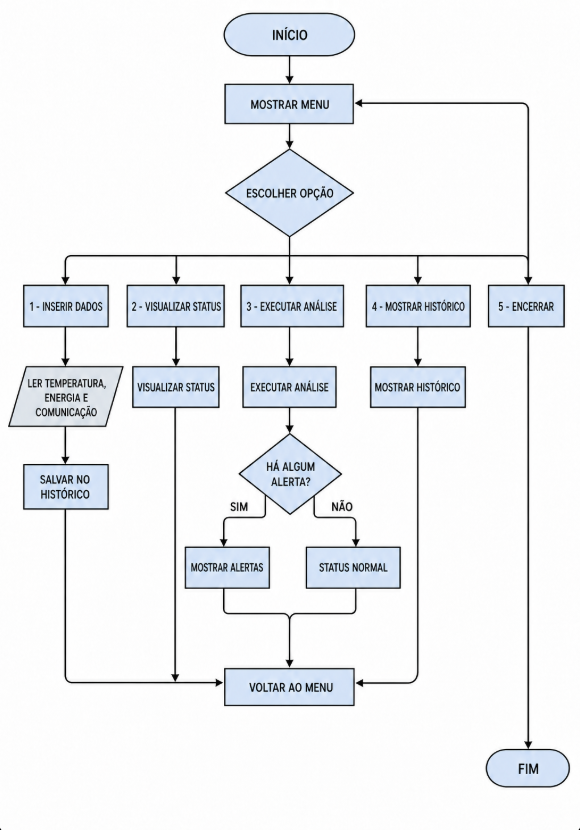

# Controle de Missão Espacial

Programa simples em Python para monitorar uma missão espacial pelo console.

O sistema permite inserir temperatura, nível de energia e estado da comunicação. Depois, é possível visualizar os dados, executar a análise e consultar o histórico.

# Explicação da lógica utilizada

Primeiro, o programa cria uma lista chamada historico, que serve para guardar todas as informações digitadas pelo usuário.

O usuário pode inserir três dados da nave:

- temperatura
- nível de energia
- comunicação

Depois que os dados são inseridos, o programa salva essas informações na lista histórico.

O sistema também permite visualizar o status atual da missão, mostrando a última leitura cadastrada.

Na parte da análise, o programa verifica se existe algum problema. Ele gera alerta se:

- a temperatura estiver acima de 80°C
- a energia estiver abaixo de 20%
- a comunicação estiver com falha

Se algum desses problemas acontecer, a missão fica com status de ALERTA. Se não tiver nenhum problema, a missão fica com status NORMAL.

O programa também possui uma opção para mostrar todo o histórico de leituras cadastradas.

Por fim, o menu principal permite que o usuário escolha o que deseja fazer e só encerra o sistema quando a opção 5 é escolhida.

# Regras

- Temperatura maior que 80: alerta de superaquecimento.
- Energia menor que 20: alerta de economia de energia.
- Comunicação igual a 0: alerta de falha de comunicação.

# Lógica utilizada

O programa usa funções, lista, `while`, `for` e `if/elif/else`. Cada leitura é guardada na lista `historico`.

# Como executar

No terminal, entre na pasta do projeto e execute:

```powershell
python mission_control.py
```

# Fluxograma


